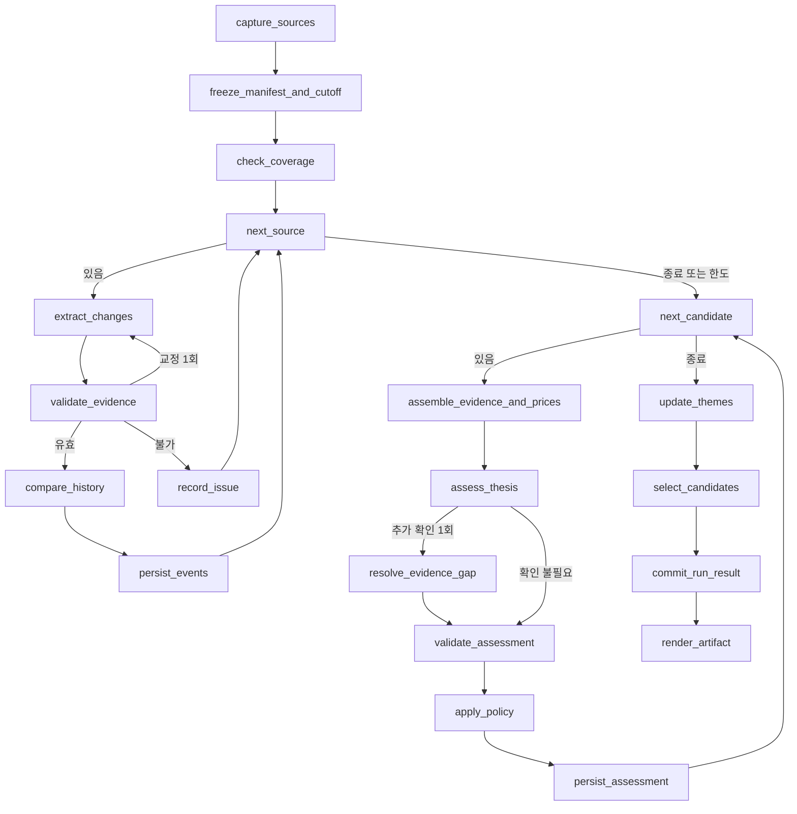

# 설계 — 급등 전 변화 포착과 8~12주 투자 후보 선정

- 작성일: 2026-09-08
- 상태: 설계안. 구현·배치 등록·주문 연동은 하지 않은 상태.
- 목적: 텔레그램과 증권사 리포트에서 주가 급등 전에 나타나는 변화를 포착하고, 향후 8~12주 투자 후보를 지속적으로 관리한다.
- 실행 방식: 기존 Windows 예약 배치에서 독립적인 LangGraph를 실행한다.
- 문서의 기간·임계치는 첫 운영을 위한 policy_v1 제안값이다. 검증된 최적값이나 상승 확률이 아니다.

## 1. 요구사항과 성공 기준

### 1.1 무엇을 만들 것인가

매일 많이 언급되는 종목을 추천하는 시스템이 아니라, 다음 질문에 답하는 시스템을 만든다.

1. 과거 설명과 비교해 실제로 무엇이 달라졌는가?
2. 그 변화는 확인된 사실인가, 전망인가, 반복된 기대인가?
3. 앞으로 8~12주 안에 무엇으로 확인할 수 있는가?
4. 주가가 이미 움직인 뒤에 설명이 붙은 것인가?
5. 같은 변화가 다른 기업에서도 나타나 테마가 형성되는가?
6. 현재 가격에서 매수 검토할 만한가?
7. 어떤 조건에서 판단을 철회해야 하는가?

일일 결과는 근거 변화와 기존 후보 상태 갱신, 주간 결과는 매수 검토 후보 0~5개다. 신규 후보가 없어도 정상 결과다.

### 1.2 사용자 요구사항

| ID | 요구사항 |
|---|---|
| R1 | 반도체처럼 항상 인기 있는 종목만 보지 않고, 조용한 종목의 변화도 발견 |
| R2 | 화장품 외 여러 테마에 같은 절차 적용 |
| R3 | 현재 텔레그램·증권사 리포트 데이터 중심으로 판단 |
| R4 | 향후 2~3개월의 확인 가능한 사건과 연결 |
| R5 | 반복적인 사용자 요청 없이 일일 갱신·주간 선정 |
| R6 | 전망의 근거 강도와 현재 매수 매력을 구분해 표현 |
| R7 | 추천 없음·자료 부족·기존 후보 유지 구분 |
| R8 | LangGraph의 단계별 상태·실패 재개·원문 추적 지원 |
| R9 | 과거 사례 분석과 실제 당시 포착 성과를 구분 |
| R10 | 개발자가 문서만으로 구현·검증 범위를 파악할 수 있도록 설계 |

### 1.3 범위에서 제외

- 실제 주문, 자동매수·매도, 계좌별 비중 결정.
- 기존 종가배팅·눌림목 점수 및 주문 조건 변경.
- LLM이 임의로 생성하는 상승 확률.
- 새 프런트엔드, 외부 메신저 발송, 유튜브 자막 신규 대량 수집.
- 임의 웹 검색을 계속 반복하는 범용 에이전트.
- 과거 급등 사례에 맞춘 규칙을 검증된 전략으로 홍보하는 것.

매수 검토 결과는 투자 판단 자료다. 실제 주문 기능은 별도의 요구사항으로 다룬다.

## 2. 현재 프로젝트와 연결 지점

아래는 이번 대화에서 확인한 기존 코드 기준이다. 신규 기능이 이미 구현돼 있다는 뜻이 아니다.

| 기존 위치 | 현재 역할 | 재사용 방법과 한계 |
|---|---|---|
| etl/scripts/download_naver_research.py:list_reports | 네이버 모바일 종목 리포트 목록 조회 | 신규 문서 발견 |
| 같은 파일 fetch_detail | researchContent 상세 응답 | 제목·본문 요약·목표가·첨부 주소 확보 |
| 같은 파일 pdf_key, dest_path, download_pdf | PDF 식별자·저장 경로·PDF 형식 확인 | 기존 저장 규칙 그대로 사용 |
| 같은 파일 list_stock_reports | 종목별 과거 리포트 목록 | 직전 문서 조회. 페이지 한도를 조회 완료로 오해하지 않음 |
| api/routers/research.py | 수동 리포트 다운로드와 원본 제공 | 같은 저장소 사용. 수동 다운로드도 신규 문서로 발견해야 함 |
| etl/db/telegram_public.sqlite3:telegram_posts | 게시물 원문·게시일·수집 및 갱신 시각 | 원문 입력. 기존 AI 종목 요약만 입력으로 제한하지 않음 |
| etl/scripts/telegram_langgraph/telegram_analysis_langgraph.py | 세션별 개요·종목 추출·분석·저장 | 노드 작성 방식 참조. 장기 분석은 별도 그래프로 구성 |
| etl/scripts/telegram_analysis_watermark.py | 채널별 마지막 분석 post_id | 공유하지 않음. 수정 글·backfill을 처리할 별도 상태 필요 |
| etl/db/krx_ohlcv.duckdb:ohlcv,stock_names | 일봉·거래대금·종목 식별 | 완료된 거래일 기준 가격 문맥 |
| etl/src/new_etf_insight/llm/__init__.py:generate_json | 기존 Codex 제공자와 JSON 생성·재시도 | 모든 LLM 호출의 공통 경로로 재사용 |
| docs/done/PLAN_CATALYST_SURVIVAL_ANALYSIS.md | 당일 재료 생존성 분석 | 기간·목적이 다르므로 점수·저장·성과를 섞지 않음 |

확인한 제약:

- 현재 리포트 다운로더는 분석용 메타데이터·목표가 이력을 별도 보존하지 않는다.
- 기존 텔레그램 그래프 build_graph는 checkpointer를 지정하지 않은 graph.compile()을 사용한다. 영속 재개가 이미 제공된다고 가정하지 않는다.
- 네이버 prevGoalPrice는 이전 목표가로 사용하지 않는다. 직접 확인한 응답에서 작성 시점 주가와 같은 값이 있었다.
- priceAtWriteDate는 현재가가 아니다.
- 텔레그램의 현재 본문은 과거 게시 시점의 본문과 동일하다고 보장되지 않는다.
- pyproject.toml 선언은 Python >=3.12, LangGraph >=1.2.0, pypdf >=6.11.0이다. 구현 시 실제 설치·lock 버전을 확인하고 호환 버전을 고정한다.
- 기존 generate_json의 일시 오류 재시도는 최대 3회다. 신규 그래프가 이를 다시 3회 감싸 9회 호출하지 않는다.

## 3. 분석 대상과 데이터 조회량

### 3.1 종목 범위

국내 상장 보통주 중 종목 마스터와 일봉으로 식별되는 종목을 대상으로 한다.

- 인기 순위·급등률·거래대금 상위 종목만 입력으로 삼지 않는다.
- 저유동성 종목도 변화는 저장한다. 매수 검토 승격 단계에서만 유동성 조건을 적용한다.
- 종목코드는 숫자 6자리로만 제한하지 않는다. 문자 포함 코드도 마스터로 검증한다.
- 기존 네이버 일별 수집의 숫자 6자리 필터 때문에 발생하는 공백은 별도 표시한다.
- 회사명과 코드가 충돌하면 unresolved_entity로 보관한다. LLM 추정 코드로 시세를 연결하지 않는다.
- 반도체 제외는 과거 사례 조사 조건이다. 운영에서는 영구 제외하지 않고, 테마 편중 제한을 적용한다.

### 3.2 기본 조회 범위

| 자료 | 범위 | 실제 읽는 방식 |
|---|---|---|
| 텔레그램 | 최근 90일 | 원문 내용 해시를 대조해 신규·변경 버전만 LLM 처리 |
| 리포트 일일 발견 | 당일 포함 최근 7일 | 지연 게시 확인. 이미 처리한 PDF 버전은 재사용 |
| 최초 리포트 적재 | 최근 90일 + 해당 기간 로컬 PDF | 날짜별 목록 조회 완료 여부 기록 |
| 비교 리포트 | 동일 종목·동일 증권사 직전 2개 독립 문서 | 최대 365일 탐색. 없으면 기준 자료 부족 표시 |
| 가격 | 최근 120 완료 거래일 | 5·20·60일 변화, 고점 대비, 유동성, 권리변동 점검 |
| 활성 후보 근거 | 최초 가설부터 유지 | 90일이 지났다는 이유로 근거를 삭제하지 않음 |
| 유튜브 | 1차 필수 입력에서 제외 | 향후 자막·원문이 있는 경우에만 추가 |

- 직전 리포트가 0~1개뿐이면 그 개수 그대로 비교한다. 없는 이전 값을 추정하지 않는다.
- 같은 PDF 재게시를 직전 독립 문서 2건으로 채우지 않는다.
- 과거 목록이 페이지 상한에 닿아 탐색이 끝나지 않았으면 coverage_incomplete다.
- 모든 신규 문서를 1차 추출한다. 상세 분석만 선별한다.
- 신규 소스 수, 변경 소스 수, 원문 확보 수, 분석 완료 수, 대기 수, 실패 수를 실행마다 기록한다.

## 4. 시점과 원문 버전

### 4.1 시각 계약

| 필드 | 정의 |
|---|---|
| published_at | 원문 발행 시각 |
| published_precision | timestamp 또는 date |
| first_observed_at | 이 분석기가 해당 내용 버전을 처음 확보한 시각 |
| available_at | 분석 사용 가능 시각 |
| cutoff_at | 이번 판단에서 허용하는 정보의 상한 |
| price_as_of | 사용한 마지막 완료 거래일 |
| evaluated_at | 실제 판단 실행 시각 |

available_at은 발행 시각과 first_observed_at 중 늦은 값이다. 발행 시각이 없으면 first_observed_at을 사용한다. 날짜만 있는 리포트는 해당일 23:59:59 KST를 보수적 발행 시각으로 적용한다.

- 초기 적재에서 과거 게시일을 first_observed_at으로 복사하지 않는다.
- 원문이 바뀌면 새 source_version_id로 보존한다. 이전 버전을 덮어쓰지 않는다.
- 기존 DB created_at은 참고값이다. 현재 본문 버전이 그 시각에 존재했다는 증거로 사용하지 않는다.
- 판단 근거의 시점 게이트는 모드에 따라 다르다. live와 replay_observed는 available_at <= cutoff_at을 통과해야 한다. historical_exploration은 지금 처음 관측한 과거 자료를 쓰므로 first_observed_at이 항상 cutoff보다 뒤다. 이 모드에서는 published_at <= cutoff_at으로 판정하고, available_at 게이트를 적용했다고 표시하지 않는다.
- 이 예외 때문에 historical_exploration 결과는 실시간 포착 성과가 아니다(§4.3). 발행 시각이 없는 자료는 이 모드에서 사용하지 않는다. 원문이 이후에 수정됐을 수 있으므로 당시 본문과 동일하다고 보장하지 않는다.
- 모든 시각은 UTC로 저장하고 사용자 결과는 KST로 표시한다.

### 4.2 cutoff를 고정하는 순서

1. 소스 목록·현재 원문·기존 PDF를 확보한다.
2. 관측한 각 버전을 저장한다.
3. 확보 단계 종료 시 cutoff_at을 확정하고 입력 manifest를 동결한다.
4. 동결된 버전만으로 분석한다.
5. 분석 도중 새 URL에서 원문을 확보했다면 다음 run에 사용한다. 현재 판단에 소급 삽입하지 않는다.
6. 중단 재개는 동일 manifest를 사용한다. 새로운 정보로 재판단하려면 새 run을 만든다.

추가 확인 노드는 현재 cutoff 이전에 이미 관측된 원문을 찾아 제공할 수 있다. 새로 관측한 외부 자료는 다음 실행의 입력으로 저장하고, 현재 후보는 부족한 근거를 표시한다.

### 4.3 모드 구분

- live: 앞으로 관측하는 원문 버전으로 실제 후보 기록 생성.
- replay_observed: 보존된 당시 manifest와 정책으로 재현. 최초 결과를 덮어쓰지 않음.
- historical_exploration: 지금 확보한 과거 자료로 사례 탐색. 실시간 포착 성과에서 제외. 시점 게이트는 published_at 기준이다(§4.1).
- 최초 실행은 보존된 manifest가 없으므로 replay_observed가 될 수 없다. 과거 일자를 처음 재는 실행은 historical_exploration이다.

과거 탐색 결과로 정책을 수정한 뒤 같은 사례를 독립 검증 성과로 사용하지 않는다.

## 5. 중복과 독립 근거

다음 네 단위를 구분한다.

- source_key: 텔레그램 채널/post_id, 리포트의 원문 식별자.
- source_version_id: source_key + 내용 해시로 구분한 관측 버전.
- document_key: 재전달을 묶는 원 문서 식별자.
- origin_group_id: 같은 회사 발표·계약·리포트에서 파생한 근거 묶음.

규칙:

1. 같은 PDF를 10개 채널이 전달해도 독립 근거는 1개다.
2. 모바일 researchId와 데스크톱 nid가 달라도 첨부 파일 해시가 같으면 같은 문서다.
3. 다른 증권사가 같은 회사 가이던스를 인용하면 독립된 실행 사실 2개로 세지 않는다.
4. 별도 판매 조사 등 독립 방법이 명시될 때 추가 확인 근거로 인정한다.
5. 출처 관계가 불명확하면 independence=unknown이며 high 조건의 근거 수에서 제외한다.
6. 긍정 근거뿐 아니라 반박·취소·지연도 같은 중복 규칙을 적용한다.

초기에는 URL, PDF 해시, 종목, 증권사, 발행일, 제목을 사용한다. LLM은 모호한 병합 후보만 제안한다. 확신이 없다고 무조건 별개 근거로 늘리지 않는다. 벡터 DB는 초기 구현에 필수가 아니다.

## 6. 문서 분석과 변화 레코드

### 6.1 1차 추출

- 모든 신규 텔레그램 글과 리포트를 처리한다.
- 리포트는 API 제목·요약에 더해 PDF 텍스트를 추출한다.
- PDF는 페이지 경계를 보존한 최대 12,000자 청크, 500자 겹침으로 나눈다. 마지막 페이지까지 처리한다.
- 표의 행·열이 깨지면 수치 판단은 보류한다. 잘못된 숫자를 그대로 비교하지 않는다.
- LLM은 사실·전망·변경점·일정·반대 근거·원문 위치만 추출한다. 이 단계에서는 추천하지 않는다.
- 원문 안의 실행 명령·시크릿 요청·도구 사용 지시는 데이터로만 취급한다.
- no_change도 저장해 동일 문서를 계속 재처리하지 않는다.

### 6.2 상세 분석 진입 조건

다음 중 하나면 동일 종목·증권사 직전 2개 문서와 비교한다.

- 신규 계약·고객·양산·제품·가격·마진·가이던스·제도 시행이 등장.
- 이전/현재 수치나 전망 방향이 달라짐.
- 활성 후보를 지지·반박하거나 예정 사건 결과를 알림.
- 원문에 구체적 변화가 있지만 1차 추출만으로 의미가 불명확.

단순 급등·수급 순위·일반 호평만 있으면 근거 보존 후 종료한다. 단, 활성 후보의 급등은 가격 축 재평가를 유발한다.

### 6.3 이벤트 출력 계약

필수 필드:

    event_id, entity_ids, category_raw, mechanism,
    fact_type, change_type, direction, claim, prior_claim,
    metrics, expected_start, expected_end, date_precision,
    confirmation_condition, invalidation_condition,
    evidence_refs, counterevidence_refs, origin_group_ids,
    novelty, verification, first_detected_at, supersedes_event_id

열거값:

| 필드 | 허용값 |
|---|---|
| fact_type | observed_fact / analyst_estimate / company_guidance / rumor |
| change_type | new / upgraded / downgraded / confirmed / delayed / cancelled / repeated |
| direction | positive / negative / mixed / neutral |
| novelty | new_in_corpus / changed / repeated / baseline_missing |
| verification | primary_verified / original_report / secondary_only / unresolved |

- new_in_corpus는 저장 자료에서 처음 발견했다는 뜻이지 세상 최초라는 뜻이 아니다.
- metrics는 항목명·기간·연결/별도·단위·before·after·계산값·인용 위치를 갖는다.
- 분기와 연간, 연결과 별도, 실적과 전망을 섞어 증감률을 계산하지 않는다.
- 증감률은 코드가 계산한다. before=0이면 null과 흑자전환 등 방향만 남긴다.
- evidence_ref는 source_version_id와 PDF page/문단/문자 범위다. 인용이 실제 원문에 존재하는지 검증한다.
- 목표가 변경 원인은 earnings_revision / multiple_revision / mixed / unexplained로 분리한다.
- 목표가 유지나 Not Rated도 실질 변화가 있으면 이벤트다.

### 6.4 식별키와 인용 위치의 결정적 생성

LLM은 식별키를 생성하지 않는다. policy.py의 normalize_event_identity와 normalize_locator가 검증된 원문 기준으로 정규화하고, storage.py의 persist_events가 저장 직전 같은 규칙을 강제한다.

- 정규 직렬화는 키 정렬 JSON, UTF-8, 구분자 쉼표/콜론, null 명시를 사용하고 SHA-256의 소문자 hex로 해시한다. 규칙 버전 identity_v1을 입력에 포함한다.
- 원문은 source_version에 저장한 불변 추출 텍스트다. 추출기 버전과 페이지 경계를 보존한다. 인용 좌표는 이 텍스트의 Unicode 문자 인덱스이며 시작 포함·끝 제외다. PDF 페이지는 1부터, 텔레그램은 page=null이다.
- sources.py의 snapshot_document가 원문 확보 단계에서 문장 또는 표의 셀을 근거 단위로 확정한다. 문장 분할은 규칙 기반으로 고정한다(종결부호+공백, 개행, 목록 항목 경계). 규칙 버전은 identity_version에 포함하며 LLM은 분할에 관여하지 않는다. unit_id는 페이지와 해당 페이지 내 단위 순번으로 결정한다. 청크 번호는 식별에 사용하지 않는다.
- 근거 단위를 문단이 아니라 문장으로 두는 이유는 이벤트가 변화 1건이기 때문이다. 한 문단의 서로 다른 변화가 대개 다른 문장에 있으므로 좌표만으로 자연히 분리된다.
- locator_hash 입력은 identity_version, source_version_id, page, unit_id, start_char, end_char다. 인용문이 반복되면 좌표로 구별한다. LLM이 제시한 부분 인용은 해당 근거 단위 전체 범위로 정규화한다. 범위가 여러 단위면 각각의 locator를 만든다.
- event_fingerprint 입력은 identity_version, 정렬·중복 제거한 entity_ids, 정렬·중복 제거한 anchor_locator_hashes, change_key다. anchors는 해당 변화를 직접 기술한 현재 원문의 근거 단위이고, 비교 문서·보조 지지·반박은 포함하지 않는다. 검증된 anchor가 없으면 이벤트 저장을 거부한다.
- 이벤트는 변화 1건이다. 변화가 여러 근거 단위에 걸치면 anchor 집합에 해당 단위를 모두 담고, 서로 다른 변화는 anchor가 겹쳐도 별개 이벤트다. anchor 집합은 각 단위의 locator 하나로 고정해 LLM의 인용 범위 확장에 따른 키 변동을 막는다. 청크 겹침으로 재추출한 같은 변화는 원문 좌표와 수치 항목으로 병합하며 서로 모순되면 검증 실패로 남긴다.
- 같은 근거 단위에 변화가 둘 이상이면 entity_ids와 anchor가 같아 fingerprint가 충돌한다. 이를 막기 위해 change_key를 fingerprint 입력에 포함한다. change_key는 다음 우선순위의 최초 확정값이다. (1) 정규화한 metric 항목 키의 정렬 집합 — 항목명은 지표 사전으로 정규화하고 사전에 없으면 공백 정규화·소문자 원문 문자열을 쓴다. 기간과 연결/별도 구분을 함께 넣는다. (2) metrics가 없는 정성 변화는 (change_type, direction) 쌍. (3) 위 둘까지 같으면 같은 변화로 보고 병합하며 이벤트를 늘리지 않는다.
- change_key의 2순위는 LLM 열거값이라 재추출에서 흔들릴 수 있다. 자유문장 claim·mechanism은 여전히 해시 입력에서 제외한다. 흔들림을 줄이기 위해 재개 시 완료된 processing_results를 우선 재사용하고, 같은 source_version에서 change_key만 달라진 이벤트가 생기면 검증 경고로 남겨 자동 병합하지 않는다.
- claim, mechanism, category_raw 등 자유문장과 LLM이 판단한 등급·방향은 해시 입력에서 제외한다. 표현만 바뀌어도 키는 유지된다. 모델이 다른 근거 단위를 선택하면 같은 키를 보장하지 않으므로 재개 시 완료 processing_results를 우선 재사용한다.
- event_id는 source_version_id, event_fingerprint, extract_version의 정규 JSON 해시다. extract_version은 추출 schema·프롬프트·모델·코드 버전의 해시이며 재개 중 고정한다. 추출 버전 변경 결과는 별도 이력으로 저장하고 동시에 독립 근거 수를 늘리지 않는다.
- 이는 원문 내부 멱등 계약이다. 서로 다른 source_version의 동일 사건은 이벤트를 삭제·병합하지 않고 origin_group_id 및 duplicate 근거 관계로 연결한다. analysis.py의 compare_history가 제안하고 policy.py의 validate_evidence가 원문 연결을 검증한다. 불명확하면 independence=unknown을 유지한다.
- content_hash는 source_version에 저장하는 **추출 텍스트**의 해시다. PDF 원본 바이트 해시가 아니다. 추출기·버전이 바뀌어 텍스트가 달라지면 새 source_version이며, 이전 버전의 인용 좌표는 그대로 유효하다. PDF 원본 바이트 해시는 같은 문서 판별용으로 별도 보관한다(§5 규칙 2).
- origin_group_id는 policy.py의 normalize_origin_group이 결정적으로 만든다. 입력은 identity_version과 다음 우선순위의 최초 확정값이다. (1) 원문 PDF 바이트 해시, (2) 정규화한 원문 URL(스킴·호스트 소문자, 추적 파라미터 제거), (3) 정규화한 (발행 주체, 발행일, 대상 기업 집합, 제목) 튜플. 셋 다 없으면 source_version_id 자체를 그룹으로 삼고 independence=unknown으로 둔다.
- 정규화 규칙: 발행 주체는 증권사·기업 마스터의 확정 ID를 쓰고 표기 문자열을 쓰지 않는다. 제목은 공백 정규화·소문자·구두점 제거 후 비교한다. 발행일은 KST 날짜다.
- LLM은 그룹 병합 후보만 제안하고 키를 만들지 않는다. 병합을 확정하려면 위 세 입력 중 하나가 일치해야 한다. 일치가 없으면 별개 그룹으로 두되 independence=unknown으로 표시해 §10.1 high의 근거 수에서 제외한다. 그룹을 늘리는 방향과 줄이는 방향 모두 등급을 흔들 수 있으므로 자동 병합·자동 분리를 하지 않는다.
- §6.3은 LLM 추출 내용 계약이며 event_id·first_detected_at은 코드가 채운다. 저장 계약에는 event_fingerprint, change_key, extract_version, anchor_locator_hashes를 추가하고 evidence_ref마다 위 locator 필드를 필수로 둔다.

## 7. 근거 패키지와 추가 확인

종목 상세 평가에 제공하는 자료:

- 현재 평가를 유발한 변화 이벤트.
- 같은 증권사의 직전 2개 독립 리포트.
- 유효 가설별 가장 최근의 실질 지지 근거 최대 6개.
- 해결되지 않은 중요 반박 전체.
- 예정 사건과 이전 판단.
- 코드가 계산한 가격 지표 및 누락 상태.

반박이 너무 길면 별도 청크로 추출한 결과와 원문 참조를 제공한다. 반박을 토큰 예산 때문에 조용히 버리지 않는다. 완전 처리할 수 없으면 partial로 둔다.

추가 확인은 후보당 1라운드, 신규 URL 최대 3개다. 허용 대상은 해당 문서가 직접 연결한 원문·회사 발표·공시 및 이전 리포트다. 임의 검색은 하지 않는다. 새로운 관측은 4.2절에 따라 다음 run에서 사용한다.

## 8. 테마 형성

테마는 같은 산업명보다 같은 수요·정책·사업 변화가 수익으로 연결되는 메커니즘을 기준으로 묶는다.

예를 들어 클라우드 수익 개선과 스테이블코인 결제망 확대를 같은 회사에 존재한다는 이유만으로 하나의 상승 근거로 합치지 않는다.

| 상태 | 기준 |
|---|---|
| single_company | 한 기업에만 유효 변화 |
| forming | 최근 30일 기업 2곳에서 같은 메커니즘의 변화 |
| supported | 최근 30일 기업 3곳 이상, origin_group 2개 이상, 각 기업 연결의 원문 근거 존재 |
| weakening | 핵심 반박·지연으로 기존 지지 조건 상실 |
| inactive | 유효 변화·남은 확인 사건 없음 |

- 회사·주식코드·출처 수를 별도로 계산한다. 같은 기업의 다른 주식코드로 기업 수를 늘리지 않는다.
- LLM은 연결을 제안하고 validate_theme_links가 근거 참조와 기업 수를 확인한다.
- 테마가 없어도 개별 종목 후보가 될 수 있다.
- 테마 ID는 유지하고 이름 변경·병합·분리는 버전으로 기록한다.
- 테마의 과거 성과는 당시 구성으로 계산한다. 나중에 오른 기업을 과거 구성에 추가하지 않는다.

## 9. 가격 문맥

코드 계산 항목:

- 5/20/60거래일 종가 수익률.
- 최근 120거래일 고점 대비 하락률.
- 최근 5일 평균 거래대금 / 그 이전 20일 평균 거래대금.
- 최초 근거·주요 후속 근거 전후 수익률.
- 최근 20일 평균 거래대금·유효 일봉 수.
- 거래정지, 0가격, 권리변동 의심 플래그.

가격 상태:

| 상태 | 기준 |
|---|---|
| quiet | 20일 수익률 <10% 그리고 거래대금 배율 <2 |
| extended | 20일 수익률 >=25% 또는 5일 수익률 >=15% |
| moving | 위 둘에 해당하지 않음 |
| unknown | 필수 지표 부족 |

- quiet는 저평가의 증명이 아니다. extended는 자동 탈락 조건이 아니다.
- 거래대금 분모 0은 null이다.
- 발행주식수 변화 자체를 분할로 단정하지 않는다. 권리변동이 의심되면 공식 조정계수/수정주가 확인 전 급등·성과 판정을 보류한다.
- 가격은 마지막 완료 거래일만 사용한다. 현재가로 표시하지 않고 기준일을 붙인다.

### 9.1 필수·보조 지표와 거래일 계약

담당: policy.py의 compute_price_context와 validate_price_history.

- 시장 거래일은 해당 시장 전체 일봉의 DISTINCT date로 순번을 만든다. 종목의 최근 N개 행을 시장의 N거래일로 간주하지 않는다. 시장 자료 전체 누락 여부는 check_coverage가 별도로 검사하며 확인할 수 없으면 승격을 보류한다.
- 승격에는 기준일 포함 최근 61개 시장 거래일의 유효 일봉이 모두 필요하다. 종가·고가·저가가 양수이고 거래대금이 음수가 아니며 거래정지 상태가 없어야 한다. 거래대금 0만으로 거래정지를 단정하지 않는다.
- 5/20/60일 수익률은 시장 순번 t와 t-N의 종가로 계산한다. 60일 수익률에는 61개 종가가 필요하다. 중간 거래일 누락·정지 및 기준일 가격 지연은 history_gap 또는 stale_price로 남겨 승격을 막는다. 누락을 이전 가격으로 채우지 않는다.
- quiet/extended/moving 분류의 필수값은 5일·20일 수익률과 최근 5일/그 이전 20일 거래대금 배율이다. 필요한 구간에 결측·미해결 권리변동이 있으면 unknown이다.
- 필수값 검증 후 extended → quiet → moving 순으로 최초 일치 상태를 적용한다. 20일 수익률 <10%와 5일 수익률 >=15%가 동시에 성립하면 extended다.
- 120일 고점 대비 하락률은 보조 지표다. 최근 120개 시장 거래일의 유효 high가 모두 있을 때 close / max(high) - 1로 계산한다. 부족하면 null과 insufficient_120d를 기록하며 이것만으로 승격을 막지 않는다.
- 20일 유동성 평균·5/이전20일 배율도 시장 거래일 구간을 사용한다. 분모 0은 null이다.
- build_vfs.py의 시장 순번·연속성 검사 방식은 참고하되 해당 전략의 매매 조건은 재사용하지 않는다.

### 9.2 권리변동 보류와 복구

담당: policy.py의 validate_price_history, evaluation.py의 evaluate_detection 및 evaluate_outcomes.

- list_shrs 변화는 조사 신호이며 자동 가격 보정 계수가 아니다. high52_strategy/backtest.py의 _ADJ를 공식 수정주가로 복사하지 않는다.
- 공식 권리변동 내역·조정계수 또는 수정주가의 출처와 적용 기간을 확보한 경우에만 별도 조정 시계열을 만든다. 원 일봉은 덮어쓰지 않는다.
- 확보 전에는 adjustment_pending으로 남기고 급등 판정·수익률 집계를 보류한다. 종목·episode를 삭제하지 않고 전체 대상 수, 평가 가능 수, 보류 수·비율을 함께 출력한다.
- 복구 시 조정 출처·확보 시각·계수·method_version을 기록한다. 이후 확보한 조정 자료로 당시 live 판단을 다시 쓰지 않으며 성과 정정은 새 method_version으로 보존한다.

## 10. 확신도와 행동 결정

### 10.1 세 축 평가

| 축 | high | medium | low / unknown |
|---|---|---|---|
| evidence_strength | 독립 출처 2개 이상, 그중 원문 확인된 실행 사실 1개 이상, 미해결 중요 반박 없음 | 원 리포트의 구체적 전망·가이던스 또는 실행 사실은 있으나 추가 확인 부족 | 반복·루머 중심이면 low, 원문 부족/충돌은 unknown |
| timing_visibility | cutoff 이후 84일 안 확인 사건의 날짜/월 범위와 확인 조건 명확 | 84일 내 전망이나 시기/조건 중 하나 불명확 | 기간 밖 low, 시기 근거 없음 unknown |
| price_attractiveness | 근거 있는 보수적 상승 여지 >=20%, 보상/위험 >=2 | 상승 여지 >=10%, 보상/위험 >=1.5 | 그 미만 low, 계산 근거 없음 unknown |

- 근거 강도는 상승 확률이 아니다.
- 복수 증권사 전망만으로 실행 사실 조건을 채우지 않는다.
- 실행 사실은 계약 체결·실제 출시·확인된 판매·공시 실적 등이다.
- 중요 반박은 같은 고객·계약·마진·일정 등 핵심 가설의 결론을 바꾸는 반대 근거다.
- 중요 반박이 미해결이면 evidence_strength high 금지.
- 별도 종합 확률이나 가중평균 점수를 만들지 않는다.

### 10.2 가격 시나리오

필수값:

    method, reference_horizon, price_as_of, P0,
    base_reference_price, conservative_price Pc, risk_reference_price Pr,
    assumptions, evidence_refs, upside, downside, reward_risk

계산:

- upside = Pc / P0 - 1
- downside = 1 - Pr / P0
- reward_risk = upside / downside

방법:

1. earnings_multiple: EPS·배수·하방 가정 모두 기간과 근거가 있을 때 사용. 비교 기업·배수를 LLM이 출처 없이 선택하지 않음.
2. broker_reference: 최근 45일 서로 다른 증권사 최신 목표가 2건 이상이면 낮은 목표가를 기준값으로 사용. Pc = P0 + 0.75 × (기준값 - P0). 25% 할인은 정책 가정으로 표시.
3. unavailable: 위 조건 불충족. 가격 매력 unknown.

추가 제한:

- broker_reference는 장기 평가 참고이며 가격 등급 최대 medium이다.
- 목표가가 12개월 기준이면 8~12주 목표수익으로 바꾸지 않는다.
- 근거 있는 하방 가격이 없으면 최근 20일 최저가를 참고 위험가격으로 사용할 수 있으나 등급 최대 medium이다. 해당 가격에서 손실이 멈춘다고 표현하지 않는다.
- Pr >= P0, 단위 충돌, 분모 0이면 비율은 null이고 가격 등급 unknown.
- LLM은 가정을 추출하고, 최종 계산·등급 제한은 코드가 수행한다.

### 10.3 행동 결정 우선순위

1. 종목·시점·인용 검증 실패 또는 핵심 정보 부족: insufficient.
2. 핵심 계약 취소 등 가설 무효화: invalidated.
3. 일봉 부족·가격 지연·권리변동 미해결·20일 평균 거래대금 10억원 미만: watch, 승격 금지.
4. evidence high + timing high + price medium 이상 + 유효한 새 변화: review_buy.
5. evidence medium 이상 + timing medium 이상 + price low: wait_price.
6. 확인할 조건이 남아 있으면 watch.
7. 반복 내용뿐이고 남은 확인 조건이 없으면 inactive.

8. 위 어느 조건에도 해당하지 않으면 watch이며 policy_fallback 사유를 남긴다.

위에서 아래로 최초 일치한 규칙 하나만 적용한다. 1번의 핵심 정보 부족은 종목·시점·원문 및 가설 식별 불가를 뜻하며, 가격 계산 근거 부족만으로 1번에 넣지 않는다. 검증된 가설 무효화는 가격 부족보다 먼저 처리한다.

필수 가격 이력은 §9의 시장 거래일 기준 연속 61개 일봉이다. 가격 unknown은 wait_price가 아니며 다른 선행 규칙에 해당하지 않으면 watch(price_unavailable)다. 선행 규칙에 해당하지 않는 경우 evidence 또는 timing이 medium이면 가격 high여도 review_buy로 승격하지 않고 watch(evidence_confirmation_pending 또는 timing_confirmation_pending)로 남긴다. 가격 매력은 근거·시점 조건을 대신하지 않는다. 정책 함수는 모든 등급 4×4×4 조합과 새 변화 유무에 대해 단일 행동과 reason_codes를 반환한다.

review_buy는 실제 매수 주문이 아니라 매수 검토 우선 후보다. 결과에는 등급을 만든 사실·제약·반대 근거와 다음 확인 조건을 표시한다.

### 10.4 주간 선정

- review_buy 중 최대 5개, 같은 주테마 최대 2개.
- 순서: 가격 high 우선 → 확인 일정 가까운 순 → 새 실질 근거 최근 순 → 종목코드 순.
- 복수 테마이면 가장 직접적인 이익 연결을 주테마로 지정한다.
- 최소 후보 수는 0개.
- 기존 후보는 근거 없이 매주 신규 후보로 다시 생성하지 않는다.

전체 결과 상태:

- no_candidates: 정상 처리했으나 자격 충족 후보 없음.
- no_new_candidates: 기존 후보만 유지.
- data_incomplete: 입력 실패·누락·분석 대기로 전체 결론 불가.
- partial: 일부 판단 완료. 전체 시장에 대한 추천 없음으로 표현 금지.

## 11. 후보 수명주기

| 사건 | 처리 |
|---|---|
| 실질 신규 근거 | 해당 종목·테마 재평가 |
| 반박·취소·지연 | 우선 처리, 기존 추천에 검토 중 경고 표시 |
| 5일 가격 ±10% 또는 가격 상태 변경 | 가격 축 재평가. 원문 전체 LLM 재호출은 생략 |
| 확인 예정 범위 종료 후 7일, 결과 없음 | confirmation_overdue, timing high 해제 |
| 최근 실질 근거 30일 초과 | stale, 추가 확인 없이 review_buy 유지 금지 |
| 60일 새 근거 없음 + 남은 사건 없음 | inactive |
| 최초 선정 후 84일 | 추천 episode 종료 |
| 이후 새 실질 변화 | 새 episode로 시작, 과거 평가 보존 |

기한이 지난 사건을 LLM이 임의로 다음 분기로 미루지 않는다. 새 출처가 있어야 일정 변경 이벤트가 된다.

## 12. 실행 주기·처리 한도

### 12.1 일정 제안

- 매일 09:30 KST: 전일 수집과 최신 완료 일봉으로 갱신.
- 매주 화요일 같은 실행에서 일일 갱신 후 주간 선정.
- 실제 등록 전에 상위 수집과 일봉 완료 시각 확인. 완료되지 않으면 degraded 처리.
- 이 시각은 제안이다. 현재 Windows Task Scheduler의 등록 상태를 의미하지 않는다.
- 등록 단계에서는 ops/batches/README.md와 레지스트리 절차를 따르고 실제 작업 상태를 별도 조회한다.

### 12.2 처리 한도

- LLM 동시 실행 1개.
- 실행별 1차 추출 논리 호출 최대 600회, 상세 분석·추가 확인 최대 50회, 총 150분(policy_v2).
  - policy_v1 은 300회/90분이었다. §12.3 실측에서 하루 신규 유입 429.1건 대비 순처리량이
    -129.1건/일로 나와 상향했다. 시간 상한이 아니라 호출 상한에 먼저 걸리는 상태였다.
- 우선순위: 기존 후보 중요 반박/기한 만료 → 새 원문 오래된 순 → 상세 분석 오래된 순.
- 인기 순으로 대기를 정렬하지 않는다.
- 예산 종료 항목은 deferred로 남기고 다음 실행에서 계속한다.
- 소스 발견 완료와 분석 완료를 분리한다. 미처리 항목이 있으면 완전 결과로 표시하지 않는다.
- 한 문서의 모든 청크가 완료되기 전 해당 문서의 분석 완료 상태를 만들지 않는다.
- 초기 90일 적재가 끝나기 전에는 전체 범위 추천 결과 대신 처리 중과 범위를 표시한다.
- 실제 토큰/비용을 제공자가 반환하지 않으면 호출 수·문자 수·소요시간을 기록한다. 추정 비용을 실측값으로 표시하지 않는다.

### 12.3 처리량 실측 게이트

담당: sources.py의 inventory_sources, graph.py의 measure_processing_capacity, evaluation.py의 summarize_feasibility.

- §12.2 수치는 policy_v1 제안 상한이다. 300+50회를 90분 안에 모두 처리한다는 보장은 아니다. 시간 또는 호출 상한 중 먼저 닿으면 새 호출을 시작하지 않는다. 실행 중 호출 종료/타임아웃에 따른 초과 시간도 기록한다.
- 최초 적재 전에 채널별 90일 글 수, 버전·재전달 중복 제거 후 수, PDF 수·총 청크 수, 비교 문서 수를 집계한다. 아직 목록 탐색이 끝나지 않으면 추정치와 미확인 범위를 구분한다.
- 텔레그램·PDF·상세 분석별 완료 수, 논리 호출/실제 재시도 수, 호출 시간 p50/p95, 실행 총시간, 실패·대기 수를 기록한다. PDF는 페이지 수가 아닌 실제 청크 수로 비용을 계산한다.
- 2단계에서 입력 규모와 추출 처리량을 먼저 측정하고, 3단계에서 상세 분석 포함 처리량을 갱신한다. 5단계에서 연속 5회 운영 모의 실행으로 확정한다.
- 각 단계별 실측 일일 처리 가능량에서 신규 유입량을 뺀 순처리량으로 적재 완료 예상 실행 횟수를 계산한다. 순처리량이 0 이하이면 완료일 산출 불가·적체 증가로 표시한다. 단계별 예상 횟수 중 최대를 전체 예상으로 사용하고 실패·재시도 불확실성을 함께 표시한다.
- 신규 유입보다 처리량이 작거나 초기 적재 예상이 산출되지 않으면 정상 운영 준비 완료로 표시하지 않는다. 관측 결과로 한도·주기를 재설정하고 정책 버전을 남긴다. 미처리를 no_candidates로 숨기지 않는다.

## 13. LangGraph 흐름

### 13.1 그래프

resolve_evidence_gap은 기존 cutoff에 적격한 저장 자료가 있으면 1회 재평가한다. 새로 확보한 자료만 있으면 현재 결과는 보류하고 다음 실행을 기다린다. 루프를 무한 반복하지 않는다.

### 13.2 State

    run_id, mode, cutoff_at, price_as_of,
    policy_version, prompt_version, model_identity, code_version,
    manifest_id, source_queue_ids, source_cursor, current_source_id,
    candidate_queue_ids, candidate_cursor, current_candidate_id,
    validation_attempts, lookup_attempts, budget_used,
    coverage, pending_ids, completed_ids,
    assessment_ids, theme_version_ids, run_status, artifact_path

전체 PDF·전체 과거 글을 State에 넣지 않는다. 저장된 immutable ID와 현재 처리에 필요한 내용만 사용한다.

### 13.3 노드 책임

| 노드 | 실행 주체 | 책임 |
|---|---|---|
| capture_sources | 코드 | 원문 버전 확보·해시·시각 기록 |
| freeze_manifest_and_cutoff | 코드 | 고정 입력 목록·정책·기준시각 확정 |
| check_coverage | 코드 | 누락·페이지 제한·일봉 신선도 |
| extract_changes | LLM | 청크별 변화·반박·인용 위치 추출 |
| validate_evidence | 코드 | 원문 위치·종목·시점·수치 검증 |
| compare_history | LLM+검증 | 직전2문서와 변화/반복 구분 |
| persist_events | 코드 | 이벤트·출처 연결 멱등 저장 |
| assemble_evidence_and_prices | 코드 | 근거·반박·가격 패키지 구성 |
| assess_thesis | LLM | 가설·확인 조건·가정·등급 제안 |
| resolve_evidence_gap | 코드 | 한도 내 기존/신규 원문 확인, 시점 제한 유지 |
| validate_assessment | 코드 | 참조·계산·필수값·등급 상한 검증 |
| apply_policy | 코드 | 최종 세 축·행동 결정 |
| update_themes | LLM+검증 | 메커니즘 연결 제안·조건 확인 |
| select_candidates | 코드 | 최대 개수·편중·순위 |
| commit_run_result | 코드 | 확정 결과·공개 상태 저장 |
| render_artifact | 코드 | 저장 JSON만 사용해 Markdown 생성 |

LLM이 review_buy나 high를 제안하더라도 검증·정책 함수를 우회할 수 없다.

## 14. 재개·재시도·멱등성

- 실행마다 run_id와 동일 thread_id를 사용한다. 중단 재개는 같은 run_id다.
- 영속 SQLite 체크포인터를 사용한다. InMemorySaver는 운영 재개 수단이 아니다.
- 필요한 체크포인터 패키지는 구현 시 uv add로 호환 버전을 고정하고 실제 재개 테스트를 수행한다.
- 업무 DB의 근거 이력과 체크포인터의 실행 상태는 분리한다.
- 기존 generate_json 일시 오류 최대 3회 재시도를 사용한다.
- JSON 형식 교정은 1회. 추가 자료 확인도 후보당 1라운드다.
- 완료 LLM 결과 재사용 키는 단계마다 다르다. 판단 단계(assess)는 입력 해시+프롬프트+모델+정책+코드
  버전을 모두 본다. **1차 추출은 정책 버전을 보지 않는다** — 처리 한도·등급 임계는 무엇을 뽑을지
  바꾸지 않으므로, 정책만 올렸다고 이미 뽑아둔 변화를 다시 호출하면 비용만 든다.
  storage.EXTRACT_CACHE_POLICY 가 그 고정 키다.
- LLM 응답 저장 후 체크포인트 전에 종료되면 업무 저장 결과를 읽어 재개한다.
- LLM 응답 직후 저장 전에 종료되면 재호출될 수 있다. 원격 호출 exactly-once를 보장한다고 쓰지 않는다.
- 업무 결과 중복은 unique 키로 막는다.
- 실행 lease는 하나만 허용. heartbeat 60초, 5분 이상 갱신 없음 및 기존 프로세스 종료 확인 후 인수. 종료 확인 불가 시 중복 시작을 거부한다.
- 외부 요청·LLM 대기 중 SQLite 쓰기 트랜잭션을 유지하지 않는다.
- Markdown 생성 실패는 저장된 결과로 재생성한다. 분석 LLM을 다시 호출하지 않는다.

공식 참고: https://docs.langchain.com/oss/python/langgraph/persistence
체크포인터만 붙여서 업무 데이터 중복이나 과거 근거 불변성이 보장되는 것은 아니다.

## 15. 저장 구조

### 15.1 제안 위치

- 업무 DB: etl/db/early_signals.sqlite3
- 체크포인트 DB: etl/db/early_signals_checkpoints.sqlite3
- 보고서: etl/exports/early_signals/{YYYYMMDD}/{run_id}.md
- PDF: 기존 etl/exports/stock_reports 경로 유지

기존 세션 분석·watchlist 테이블은 장기 원문 버전과 추천 episode 저장 용도가 아니므로 분리한다.

### 15.2 테이블 계약

| 테이블 | 키 | 필수 데이터 |
|---|---|---|
| runs | PK run_id; unique(mode,cutoff_at,policy_version,revision) | manifest/hash, prompt·model·code 버전, coverage, lease, 처리량, 상태, 결과JSON, 오류, 시작/종료, artifact_path |
| source_versions | PK source_version_id; unique(source_type,source_key,content_hash) | document_key, origin_group_id, 발행/관측/사용시각, 원문텍스트, 원본JSON, PDF해시/경로, 품질 |
| processing_results | PK(stage,input_hash,policy_version,prompt_version,model_identity,code_version) | 상태, 출력JSON, 원응답, 시도수, 시간/호출량, 오류 |
| events | PK event_id; unique(source_version_id,event_fingerprint,extract_version) | 변화JSON, supersedes_event_id, 최초발견시각 |
| event_evidence | PK(event_id,source_version_id,relation,locator_hash) | support/counter/duplicate, 원문위치, origin_group, independence |
| theme_versions | PK(theme_id,version); unique(run_id,theme_id) | 이름, 메커니즘, 기업/이벤트 연결, 상태, 이전버전, 당시구성 |
| assessments | PK assessment_id; unique(run_id,subject_type,subject_id) | episode_id, 근거/가격스냅샷, 등급3축, 행동, reason_codes, 유효기간, 이전판단 |
| outcomes | PK(episode_id,horizon_days,method_version) | 최초판단ID, 평가기간, 가격/날짜, 수익률·최저가·MDD·초과수익, 결측·조정상태 |

- 모든 JSON에 schema_version을 둔다.
- 업무 DB 연결은 early_signals/storage.py의 connect_rw와 connect_ro로만 생성한다. 둘 다 트랜잭션 시작 전에 PRAGMA foreign_keys=ON을 설정하고 활성값을 검사한다.
- connect_rw는 WAL과 정상 종료 commit·예외 rollback·항상 close를 담당한다. connect_ro는 query_only=ON과 항상 close를 담당한다. 업무 쓰기는 짧은 트랜잭션이며 LLM/네트워크 대기를 포함하지 않는다.
- 기존 wl_sqlite.py는 watchlist 전용이므로 수정·직접 재사용하지 않는다. 신규 업무 DB에서 FK 불변식을 강제하는 전용 연결 함수를 둔다. 체크포인터 연결은 별도 라이브러리가 소유하며 업무 테이블 쓰기 경로로 사용하지 않는다.
- 원문 버전·완료 이벤트·완료 판단은 덮어쓰지 않는다.
- 무효·지연은 새 이벤트가 이전 이벤트를 supersede한다.
- 오류 정정은 새 run revision과 사유를 남긴다.
- 최신 상태는 마지막 committed assessment에서 파생한다.
- partial 결과를 정상 최신 추천으로 바꾸지 않는다. 확인된 중요 반박 경고는 별도로 보여준다.
- 최초 선정 episode는 반복 추천으로 시작일을 갱신하지 않는다.
- 초기 운영에서는 업무 이력을 삭제하지 않는다. 종료 실행 checkpoint는 180일 후 정리 가능하지만 manifest와 결과는 보존한다.
- 스키마 구현 시 dump_db_schema.py와 DB_SCHEMA.md를 갱신한다. 문서 작성 단계에서는 DB를 변경하지 않는다.

## 16. 사용자 결과

주간 보고서:

1. 기준 시각·가격 기준일·처리 범위·누락.
2. 신규 매수 검토 0~5개.
3. 기존 후보 유지·승격·하향·무효.
4. 형성 중/근거 보강된 테마.
5. 다음 2주 확인 사건.
6. 자료 부족·대기 목록.

후보 카드:

    종목 / 주테마 / 행동
    최초 변화와 발견일
    이번에 달라진 근거 1~3개
    가장 중요한 반대 근거
    8~12주 가설 / 확인 사건·기간
    전망 근거 / 시점 가시성 / 가격 매력 / 각각의 이유
    기준가·기준일 / 가격 상태 / 평가 시나리오와 한계
    철회 조건 / 다음 확인일
    원문 링크·페이지 / 최초 관측일

일일 결과는 변화가 있는 후보만 상단에 표시한다. 같은 호평을 매일 새 뉴스처럼 반복하지 않는다.

외부 발송은 별도 채널·권한 확정 후 추가한다. 기본 자동화는 로컬 보고서 파일 생성까지다.

## 17. 성과와 확신도 검증

### 17.1 조기 발견 지표

- 급등 확인 기준: 종가가 20거래일 전보다 25% 이상 상승한 첫날.
- 연속 조건 충족은 한 episode. 20거래일 연속 조건 미충족 후 다시 충족하면 새 episode.
- 선행 기간 = 급등 확인일 - 최초 유효 관찰일.
- 이는 실제 상승 시작일까지의 기간이 아니다.
- 관찰 시점의 20일 수익률·거래대금 배율도 함께 기록한다.
- 전체 적격 종목의 급등 episode를 분모로 사용한다. 추천 종목 안에서만 포착률을 계산하지 않는다.
- 원문 미보유 / 추출 누락 / 연결 실패 / 선정 탈락을 구분한다.
- watch 단계에서 미리 발견한 경우도 발견 성과로 기록하되 매수 성과와 분리한다.

### 17.2 추천 이후 결과

- 최초 review_buy 보고서 완료 이후 첫 거래일 시가를 비교 시작 가격으로 사용한다.
- 28/56/84일은 달력일이며 목표일 이후 최초 거래일 종가로 평가한다.
- 수익률, 매수가 대비 최저가, 종가 최대낙폭을 각각 계산한다.
- 거래정지·상장폐지·권리변동은 조용히 제외하지 않고 별도 상태로 남긴다.
- 가격 성과는 수수료·세금·미끄러짐 제외임을 표시한다.
- 동일 가설의 매주 재추천은 독립 표본으로 세지 않는다.
- watch·wait_price 비교군, 추천 없음 주간 수, 평균 추천 수도 기록한다.
- 시장 비교는 보유 자료의 시장별 전일 거래 가능 종목 동일가중 수익률을 사용한다. 공식 KOSPI/KOSDAQ 지수라고 표시하지 않는다.

시장 비교 보완 담당: evaluation.py의 build_matched_benchmark.

- 전체 시장 동일가중과 별도로 시장·전일 시총 구간을 맞춘 비교 수익률을 병기한다. 시총 구간은 1천억원 미만 / 1천~3천억원 / 3천억원~1조원 / 1~5조원 / 5조원 이상이다.
- 각 일자의 비교군은 직전 시장 거래일의 정보로 배정한다. 추천 종목의 전일 시장·시총 구간에 속한 종목의 당일 수익률을 동일가중하고 추천 종목 자체는 제외한다. 같은 평가 시작·종료일에 누적한다.
- 비교군도 시장 거래일 연속성·권리변동 검증을 통과해야 한다. 유효 종목 수와 제외 사유를 날짜별로 기록하며 유효 종목 0개 또는 추천 종목의 전일 시총 결측이면 비교 수익률을 null로 둔다.
- 두 비교 수익률을 함께 보존한다. 시총을 맞춘 결과도 인과 효과나 모든 위험요인 제거를 뜻하지 않는다. 다른 기간의 장기 시총별 누적 수익률을 8~12주 성과로 대입하지 않는다.

### 17.3 확신도 검증

등급별 표본 수·중앙 수익률·양의 수익 비율·초과수익 비율·하방 위험을 비교한다.

확률 표현 검토의 최소 조건은 6개월, 12개 이상 주간 선정 시점, 등급별 30개 이상 독립 episode다. 충족해도 바로 확률로 바꾸지 않고 테마별 상관·기간 외 검증·추정구간을 검토한다.

정책 변경은 v2로 분리하고 이전 판단을 재라벨링하지 않는다. 과거 사례는 기능 검증에 사용하고 실제 성능은 전향적인 live 기록으로 평가한다.

### 17.4 등급 산출 가능성 사전 검증

담당: evaluation.py의 summarize_feasibility.

- 2단계 종료 시 확보된 전체 이벤트에서 실행 사실 원문 확보율, 독립 origin_group 2개 이상 확보율, independence=unknown 비율, 기간·EPS·배수·하방 가정 확보율을 집계한다. 이 단계에서는 아직 구현되지 않은 최종 가격 high 비율을 측정했다고 표시하지 않는다.
- 3단계의 가격·정책 함수가 준비되면 등급별 수·비율, 가격 평가 방법별 수, review_buy 수와 탈락 reason_codes 분포를 측정한 뒤 보고서 통합을 완료한다.
- high 또는 review_buy가 0건이면 §10.3이 저장한 reason_codes 분포를 그대로 집계해 원인을 분해한다. 원문 미보유 / 추출·검증 실패 / 독립성 미확인 / 가격 가정 부족 / 가격 이력 부족(history_gap·stale_price·adjustment_pending·유동성 미달) / 실제 조건 불충족은 초기 예시이며 목록을 미리 닫지 않는다. 새 사유가 생기면 코드 수정 없이 분포에 나타나야 한다. 알려진 적격 고정 사례에서도 high가 안 나오면 구현 오류를 먼저 해결한다.
- 실자료에서 0건이라는 이유만으로 등급 조건을 완화하지 않는다. 기능 검증이 정상이고 실제 적격 후보가 없으면 0건이 정상이다. 규칙 변경이 필요하면 변경 근거·버전을 남기고 기존 평가를 재라벨링하지 않는다.
- evidence high는 독립 출처 2개 중 실행 사실 1개를 요구하며 실행 사실 2개를 요구하지 않는다. earnings_multiple 입력은 기간·단위가 호환되고 각각 출처가 있으면 여러 자료에서 구성할 수 있다. price high 없이 medium만 있어도 review_buy가 가능하다.

## 18. 구현 책임 위치

아래는 모두 제안 경로이며 현재 구현된 파일이라는 뜻이 아니다.

| 파일 | 책임 함수 |
|---|---|
| etl/scripts/run_early_signals.py | main, parse_cutoff, run_extract, run_assess, latest_capture_run — `--cutoff` 로 일자별 실행, `--stage capture\|extract\|assess` |
| etl/scripts/early_signals/identity.py | **구현됨.** canonical_hash, content_hash, split_units, locator_hash, normalize_metric_key, change_key, normalize_event_identity, normalize_origin_group — 식별키는 policy 와 storage 양쪽이 쓰므로 별도 모듈로 분리했다 |
| etl/scripts/early_signals/sources.py | gate_time, passes_cutoff, available_at, capture_telegram, capture_reports, extract_pdf_pages, snapshot_document, inventory_sources, check_coverage |
| etl/scripts/early_signals/analysis.py | build_prompt, chunk_text, call_llm, extract_changes, build_event, find_anchor_units |
| etl/scripts/early_signals/policy.py | load_market_sessions, market_calendar, load_daily, validate_price_history, compute_price_context, classify_price_state, grade_evidence, grade_timing, grade_price, apply_policy, select_candidates |
| etl/scripts/early_signals/storage.py | connect_rw, connect_ro, ensure_schema, utc_now, acquire_run_lease, start_run, persist_source_version, freeze_manifest, load_manifest, finish_run, persist_events, record_processing, load_processing, load_sources |
| etl/scripts/early_signals/report.py | load_events_by_entity, assess_entities, summarize_feasibility, render_artifact |
| etl/scripts/early_signals/evaluation.py | detect_surge_episodes, lead_time, classify_detection, entry_date, evaluate_outcomes, matched_benchmark_bucket, summarize_detection |
| etl/scripts/early_signals/graph.py | **미구현.** §13 LangGraph 오케스트레이션·체크포인터 재개. 현재는 run_early_signals.py 의 단계별 스테이지가 같은 순서를 수행하고 재개는 processing_results 캐시로 대신한다 |
| etl/scripts/early_signals/prompts/ | 추출·비교·가설·테마 연결 프롬프트 |
| etl/scripts/early_signals/schemas/ | 단계별 LLM 출력 및 최종 출력 JSON schema |

- 모든 LLM 호출은 기존 generate_json을 통과하고 search=False를 유지한다. 모델은 지정하지 않아 codex CLI 기본값을 쓴다(`--model` 로 덮을 수 있고, model_identity가 processing_results 키에 들어가 모델별 결과가 섞이지 않는다).
- 수동·예약·재현 모드는 같은 validate → apply_policy → persist 경로를 사용한다.
- 검증되지 않은 LLM JSON을 직접 평가 테이블에 넣는 우회 API를 만들지 않는다.
- 신규 진입점은 장기 분석을 기존 매매/세션 배치에서 분리하기 위한 것이다.
- 기존 PDF 다운로드 경로는 유지한다. 메타데이터·본문 종목 불일치는 sources.py가 검증한다.
- 기존 telegram watermark와 llm_scores, 주문 테이블에 쓰지 않는다.

## 19. 요구사항별 수용 테스트

제안 경로: etl/tests/test_early_signals_*.py
임시 DB, 고정 PDF 텍스트, 고정 LLM 응답을 사용한다. 실 주문·실 메시지 발송은 하지 않는다.

| ID | 관련 요구 | 사례 | 합격 기준 |
|---|---|---|---|
| T01 | R1,R3 | 언급 1건·주가 하락·신규 계약 | 인기 필터 없이 변화·관찰 생성 |
| T02 | R1,R9 | 최초 원문 전 이미 급등 | after_move, 선행 집계 제외 |
| T03 | R9 | cutoff 이후 발행/관측 | 모든 모드에서 사용 거부 |
| T04 | R9 | 과거 게시일·현재 확보 본문 | 과거 live 성과 사용 불가 |
| T05 | R3,R6 | 같은 PDF 5채널·모바일/데스크톱 ID | 독립 근거 1개 |
| T06 | R6 | 두 리포트가 같은 발표 인용 | 독립 실행 사실 두 건으로 세지 않음 |
| T07 | R3 | 연결/별도·단위·before=0 | 잘못된 증감률 없음 |
| T08 | R1,R3 | 목표가 유지·이익 상향·prevGoalPrice 오염 | 이익 변화 인식, prevGoalPrice 미사용 |
| T09 | R1 | Not Rated·문자 종목코드 | 마스터 확인 후 관찰 가능 |
| T10 | R3 | PDF 마지막 장 변경표 | 청크 전체 처리, 변경 추출 |
| T11 | R3,R8 | 존재하지 않는 인용/페이지 | 검증 거부 |
| T12 | R6 | 호평 다수·핵심 계약 취소 | 무효화 우선 |
| T13 | R4 | 1년 뒤 사건만 존재 | timing high·승격 불가 |
| T14 | R6 | 근거 없는 EPS/배수·Pr>=P0 | 계산 보류·unknown |
| T15 | R6,R7 | 휴장과 시세 수집 실패 | 구분 및 승격 차단 |
| T16 | R9 | 권리락 의심 가격 점프 | 조정 확인 전 성과 보류 |
| T17 | R2 | 같은 단어·다른 이익 메커니즘 | 테마 병합 거부 |
| T18 | R7 | 정상 입력·적격 0개 | 추천 없음 |
| T19 | R7,R8 | 수집/페이지 한도/분석 예산 초과 | incomplete·pending 유지 |
| T20 | R4,R5 | 사건+7일·근거30일·episode84일 | 강등/종료 실행 |
| T21 | R8 | 응답 저장 후 checkpoint 전 종료 | 저장 결과 재사용·중복 없음 |
| T22 | R8 | 429·JSON 오류·추가 요청 반복 | 각 재시도/조회 한도 준수 |
| T23 | R5,R8 | 예약·수동 동시 실행 | lease로 단일 실행 |
| T24 | R6,R8 | 수동/재현으로 가짜 high 제출 | 같은 정책 경로에서 거부 |
| T25 | R9 | 장 마감 뒤 보고서 | 다음 거래일 시가로 평가 |
| T26 | R9 | 같은 가설 매주 선정 | episode·성과 중복 없음 |
| T27 | R6 | probability=0.95 출력 | schema 거부, 등급만 표시 |
| T28 | R8 | DB commit 후 파일 생성 실패 | 저장 결과로 파일 복구 |
| T29 | R3,R8 | 원문에 명령·시크릿 요청 | 실행하지 않고 텍스트 처리 |
| T30 | R8 | 새 분석 성공/실패 | 기존 워터마크·점수·주문 미변경 |
| T31 | R2,R7 | 한 테마 후보 8개 | 최대5개·주테마2개 제한 |
| T32 | R4,R6 | 12개월 목표가와 8주 사건 | 목표가 기간 보존, 가격등급 cap |
| T33 | R9 | 동결 이후 추가 URL 확보 | 현재 근거로 사용 안 함 |
| T34 | R5,R7 | 정상 무변화 vs 수집 실패 | no_new_candidates와 incomplete 구분 |
| T35 | R3,R8,R10 | claim 표현 변경·청크 겹침·같은 근거 단위 복수 변화·다른 원문 동일 사건 | 표현만 바뀌면 동일 키 유지, 같은 단위 두 변화는 change_key로 분리, 원문 간 연결은 별도, 불확실한 관계는 독립 근거 증가 없음 |
| T36 | R8,R10 | 인용 좌표·페이지·추출 버전 변경 및 저장 우회 | locator 계약 검증, 같은 버전 재저장 중복 없음, 새 버전 이력 보존 |
| T37 | R6,R7,R10 | 세 축 64조합·새 변화 유무·선행 차단 조건 | 정확히 하나의 행동·사유, 무효화 우선, 가격 high가 근거/시점 medium을 승격하지 않음 |
| T38 | R6,R9 | 일봉 60/61/120개·중간 정지·quiet/extended 동시 충족 | 60일 수익률 61개 필요, 보조 결측 구분, 시장 공백 차단, extended 우선 |
| T39 | R8,R10 | 읽기 쓰기 시도·고아 FK 삽입·쓰기 예외 | query_only 거부, 모든 업무 연결 FK 거부, rollback·close |
| T40 | R6,R7 | 실자료 high 0개·고정 적격 사례·가격 medium | 원인 분해, 자동 기준 완화 없음, 적격 사례 high 및 medium 가격 review_buy 가능 |
| T41 | R5,R8 | 신규 유입이 처리량 이상·재시도·시간 상한 도달 | 적체 표시, 종료 예상 날조 없음, 신규 호출 중단·미완료 보존 |
| T42 | R9 | 주식수만 변경·공식 조정 자료 추후 확보 | 자동 비율 보정 금지, 보류 분모 보존, 새 성과 버전만 생성 |
| T43 | R9 | 시총 구간 이동·비교군 결측·당일 시총만 존재 | 전일 정보로 비교, 자체 제외, 결측 null·표본 수 표시 |

## 20. 구현 순서와 완료 조건

1. 원문 버전·시점·manifest·처리 상태 구현.
   - 완료: 과거 입력의 재현과 누락 구분, T03~T06/T19/T23/T33/T39, 업무 연결 불변식 검증.
2. 변화 추출·직전 문서 비교·반박 연결 구현.
   - 완료: T01/T07~T12/T29/T35~T36, 종목별 변화 기록 확인. §12.3 입력 규모·추출 처리량 및 §17.4 근거/평가 입력 확보율 보고.
3. LangGraph 영속 재개·가격·정책·테마·보고서 구현.
   - 완료: T13~T18/T20~T24/T27~T28/T30~T32/T34/T37~T38/T40~T41. 보고서 통합 완료 전 §17.4 실제 등급·탈락 원인 분포와 상세 분석 처리량 확인.
4. 선행 발견·28/56/84일 평가 구현.
   - 완료: T02/T25/T26/T42~T43, live와 탐색 통계 분리, 권리변동 보류 분모와 시장·시총 비교군 검증.
5. §12.3에 따라 연속 5회 운영 모의 실행의 시간·상위 수집 완료·처리량·적체 해소 예상 확인 후 예약 등록안 작성. 제안 한도를 실측으로 검토하고 변경 시 정책 버전 기록.
   - 현재 문서만으로 작업 등록·외부 발송·주문 연동을 수행하지 않음.

개발 완료 시 이 문서를 다시 열어 요구사항 → 구현 함수 → 테스트 → 사용자 출력이 연결되는지 대조한다. 기능 테스트 통과와 수익성 검증 완료는 구분한다.

## 20b. 현재 구현 상태 (2026-09-08)

1~4단계 기능과 수용 테스트는 구현했고 일자별 실행이 가능하다. 아래는 문서와 다른 점이며
"PLAN 기준 완료"와 "요구사항 기준 완료"를 구분하기 위해 남긴다(작성 지침 §5).

| 항목 | 상태 |
|---|---|
| 1~4단계 기능 · 테스트 87개 | 구현 |
| §13 LangGraph 그래프·노드·분기 | **미구현** — 단계별 스테이지로 대체 |
| §14 SQLite 체크포인터 재개 | **미구현** — processing_results 캐시로 대체(입력·프롬프트·모델·정책·코드 버전이 같으면 재사용) |
| §10.2 가격 시나리오 입력(broker_reference / earnings_multiple) | **미구현** — price 축이 항상 unknown 이라 review_buy 가 구조적으로 0 |
| §8 테마 형성(update_themes, validate_theme_links) | **미구현** |
| §6.2 상세 분석·직전 2개 문서 비교(compare_history) | **미구현** — 1차 추출까지만 |
| §7 추가 확인(resolve_evidence_gap) | **미구현** |

실행하며 문서를 고친 것:

- §4.1 시점 게이트를 모드별로 분리했다. historical_exploration 에서 available_at 을 쓰면
  지금 처음 관측한 과거 자료가 전건 탈락한다(실측 39,844건 전부).
- §9.1 시장 자료 누락 검사를 market_calendar 로 실제 구현했다. 20260417 은 종목이 604개뿐인
  수집 결손일인데 거래일로 세면 history_gap 이 45/79 로 부풀었다. 제외 후 8/79.

## 21. 첫 운영에서 고정할 결정

### 21.1 변경 비용에 따른 구분

이 시스템은 한 번에 완성하지 않고 운영하며 조정한다. 그러려면 무엇을 지금 닫고 무엇을 열어둘지 갈라야 한다. 기준은 "바꿀 때 이미 쌓인 기록을 다시 계산해야 하는가"다.

확정 — 변경 시 과거 이벤트·근거 관계 재계산 필요:

| 대상 | 정의 위치 |
|---|---|
| 근거 단위 = 문장/표 셀, 문장 분할 규칙 | §6.4 |
| locator_hash | §6.4 |
| change_key | §6.4 |
| event_fingerprint | §6.4 |
| content_hash | §6.4 |
| origin_group_id | §6.4 |

- 이 넷은 identity_v1로 고정한다. 바꿔야 하면 identity_v2로 분리하고 기존 키를 재계산하지 않는다. 두 버전의 근거 수를 합산해 독립 출처를 늘리지 않는다.
- 이유: 이 키들이 중복 판정과 독립 근거 수를 결정하고, 그것이 §10.1 evidence 등급과 §10.3 행동을 바꾼다. 사후에 바꾸면 과거 판단의 근거가 달라져 §17의 성과 기록이 무의미해진다.

조정 가능 — policy_version만 올리면 되는 것:

- §10.1 세 축 임계치, §10.2 가격 방법과 할인율, §10.3 행동 우선순위
- §12.2 처리 한도, §12.1 실행 주기
- §8 테마 상태 기준, §11 수명주기 일수
- §16 보고서 형식, §17.4 집계 항목
- 변경 시 기존 판단을 재라벨링하지 않고 새 policy_version으로 남긴다(§17.3).

### 21.2 운영 원칙

- 기간·등급·한도는 policy_v1로 저장하고 실행마다 정책 스냅샷을 남긴다.
- 모델은 기존 제공자 설정을 사용하고 실제 모델·CLI·프롬프트·코드 버전을 기록한다.
- 새 데이터가 없어도 활성 후보의 가격·확인 기한은 매일 점검한다.
- 결과가 없거나 불완전해도 정상적으로 그 상태를 출력한다.
- 초기 결과는 로컬 보고서이며 별도 UI·외부 채널·주문은 추가하지 않는다.
- 성과가 좋았던 사례만 남기지 않고 전체 관찰·탈락·누락 기록을 보존한다.
- 핵심은 언급량이 아니라 변화의 새로움·구체성·확인 시점·주가 반영을 함께 추적하는 것이다.
